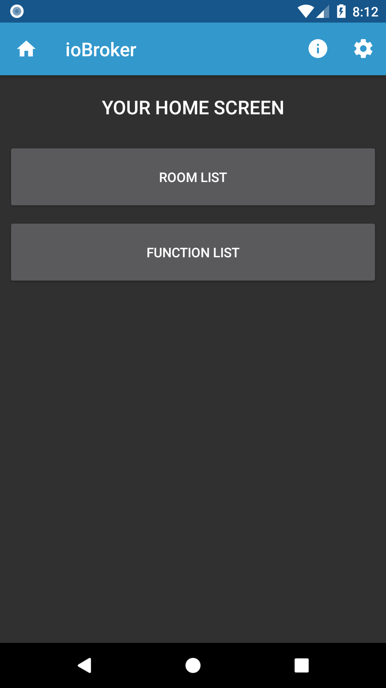

# ioBroker.android-app
Diese App ermöglicht die Überwachung und Steuerung aller Werte eines ioBroker Smart Home Systems.

ioBroker ist eine Integrationsplattform für das Internet der Dinge und dient als zentraler Server der über modulare “Adapter” mit einer Vielzahl an Systemen und Geräten kommunizieren.

Highlights der App:
- Verbindung zu ioBroker direkt oder über cloud.pro
- Anzeige der Werte aller Räume und Funktionen
- Verschiedene UI Elemente anhand der Roles von ioBroker
- Schnellzugriff auf die wichtigsten Werte vom Homescreen
- keine Zusatzadapter notwendig

Du hast Fragen oder Anregungen? Sende einfach eine E-Mail an iobroker@nisnagel.de.

## Changelog

### 0.9.x (2018-06-23)
- flag rooms and functions as favorite
- show list of favorites on homescreen
- support readonly states

### 0.8.x (2018-06-17)
- firebase crash logs added
- bugfix: validate socket url

### 0.7.0 (2018-06-15) 
- support of Android 4.4+

### 0.6.0 (2018-06-14) 
- initial public testing